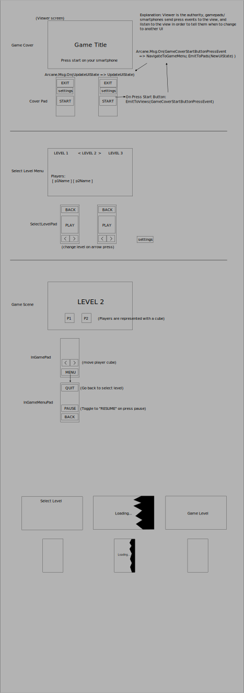

# Basic UI project GDD:

This is meant to be the starter template to many of the games we will make in the future. The big rectangle represents the PC/TV screen viewer, and the small rectangles are the gamepads/smartphones 

IMPORTANT: This is a guideline, but I will appreciate criticism/proactivity, if you think something should or could be done diferently or if you don't understand something please Let me know.

## Requirements

1. Support for animation transition on UI change for the button and panel component if applicable, implement a simple fade-in fade out, but has to be possible to add new animation without having to update each button one by one but as a prefar or some sort system.

2. Authoritative Viewer State: The gamepad sends inputs like "Player 1 pressed start button", the viewer listens to this event and decides to emit to al gamepads if necesary the "start" event for example which would change the UI of gamepads and viewer. The gamepads can have also they're own state like when they go to menu or settings for example so they don't need to tell anyone about this.

3. Button press sound: The button component must support a sound on press, and we can change this sound only once to affect all buttons, or disable sound aswell.

4. Panel and Button Component/Prefab/Scene: We can modify all instances of panels and buttons, they have they're own class to do things like check if animate on appear/disappear, if play sound on press in case of button, and we can change the texture to all instances too with this prefab/scene

## Unity Example: https://github.com/imvenx/mini-golf

This unity example has implemented already the ui system, altho is all working, I rushed it and I don't like how is done since is all put together on a big singleton "ViewManager" without any design pattern, also the scene changes destroyed some necesary objects so I had to put all inside the ViewManager gameobject and make don't destroy on load, while this approach works, is not very nice I think, and could be improved to scale better in the future and be more readable, efficient, and clean.

## GDD: 

